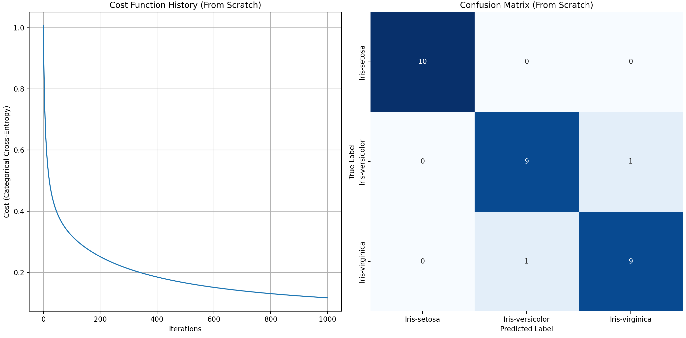
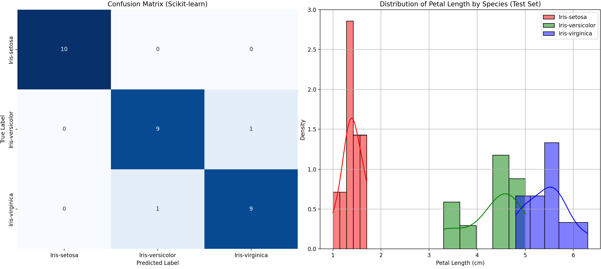

# **Multi-Class Softmax Logistic Regression on Iris Dataset**

This repository contains two Python scripts demonstrating **Multi-Class Softmax Logistic Regression** on the **Iris Flower dataset**: one implemented **from scratch**, and the other using the `scikit-learn` library.

## **Problem Statement**

The primary goal of this project is to **classify Iris flowers** into one of three species (Setosa, Versicolor, Virginica) based on their sepal and petal measurements. We compare a **custom-built Softmax Regression model** with a **library implementation**.

## **Results**

### 1. **Softmax Regression From Scratch (Using Gradient Descent)**

The Python script for this implementation is located at `softmax_regression_scratch.py`. Below are the plots showing the cost function's convergence and the distribution of predicted probabilities.

* **Accuracy:** `0.9333`

**Confusion Matrix (From Scratch):**

[[10  0  0]
[ 0  9  1]
[ 0  1  9]]

### 2. **Softmax Regression with Scikit-learn**

The Python script for this implementation is located at `softmax_regression_sklearn.py`. Below are the plots showing the Confusion Matrix and the Receiver Operating Characteristic (ROC) Curve.

* **Accuracy:** `0.9333`

**Confusion Matrix (Scikit-learn):**

[[10  0  0]
[ 0  9  1]
[ 0  1  9]]

## **Conclusion**

Both implementations achieved **comparable results** for classifying Iris flowers, with **identical accuracy** in this case.